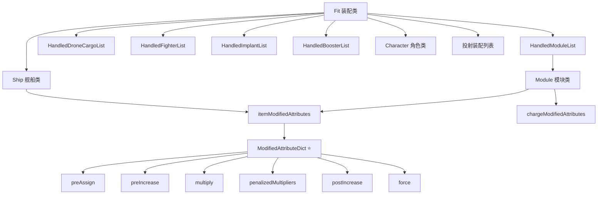

# Pyfa 装配模拟器项目技术分析报告

> **分析日期**: 2026-04-09  
> **项目地址**: https://github.com/pyfa-org/Pyfa  
> **核心引擎**: eos (https://github.com/pyfa-org/eos)  
> **对比基准**: fitting-simulator-spec.md (我们现有的装配模拟器技术规格)

---

## 一、Pyfa 项目概述

### 1.1 项目定位

Pyfa (Python Fitting Assistant) 是 EVE Online 最成熟、社区验证最久的装配模拟器，具有以下特点：
- **跨平台**: 支持 Windows、Linux、Mac
- **桌面端金标准**: 10+ 年社区验证，计算结果与游戏内高度吻合
- **开源**: 完全开源，eos 引擎可独立使用
- **功能完整**: 支持舰船装配、投射效果、指挥加成、电容模拟、DPS 计算等全部功能

### 1.2 项目结构

```
Pyfa/
├── eos/                      # 核心计算引擎（可独立使用）
│   ├── saveddata/           # 保存数据模型
│   │   ├── fit.py           # 装配核心类 ⭐ calculateModifiedAttributes()
│   │   ├── module.py        # 模块类
│   │   ├── ship.py          # 舰船类
│   │   ├── character.py     # 角色技能类
│   │   ├── drone.py         # 无人机类
│   │   └── fighter.py       # 战斗机类
│   │   └── implant.py       # 植入体类
│   │   └── booster.py       # 增强剂类
│   ├── modifiedAttributeDict.py  # 属性修正字典 ⭐ 核心计算逻辑
│   ├── calc.py              # 计算辅助函数 ⭐ 堆叠惩罚/范围因子
│   ├── capSim.py            # 电容模拟器 ⭐ 电容稳定性计算
│   ├── gamedata.py          # 游戏数据模型 ⭐ 数据库映射
│   ├── const.py             # 常量定义（枚举类型）
│   ├── effectHandlerHelpers.py  # 效果处理辅助类
│   ├── effects/             # 效果处理器目录（1.29MB，~5000个效果）
│   │   ├── effect_<id>.py   # 单个效果处理器
│   │   └── ...              # 约 5000+ 个效果文件
│   └── db/                  # 数据库相关
│       └── saveddata/       # SQLite 数据库
└── gui/                     # GUI 层（wxPython）
└── service/                 # 服务层
```

---

## 二、核心架构分析

### 2.1 整体架构模式

Pyfa 采用 **分层架构 + 事件驱动** 设计：

```
┌─────────────────────────────────────────────────────┐
│                    GUI Layer (wxPython)              │
│    ┌──────────┐ ┌──────────┐ ┌──────────┐           │
│    │ 装配界面 │ │ 属性面板 │ │ 电容面板 │           │
│    └──────────┘ └──────────┘ └──────────┘           │
├─────────────────────────────────────────────────────┤
│                   Service Layer                      │
│    ┌──────────┐ ┌──────────┐ ┌──────────┐           │
│    │ FitService│ │PriceService│ │EFXportSvc│         │
│    └──────────┘ └──────────┘ └──────────┘           │
├─────────────────────────────────────────────────────┤
│                    eos Engine ⭐                      │
│  ┌─────────────────────────────────────────────┐    │
│  │  Fit.calculateModifiedAttributes()           │    │
│  │    ├── Ship.itemModifiedAttributes           │    │
│  │    ├── Modules[].itemModifiedAttributes      │    │
│  │    ├── Drones[].itemModifiedAttributes       │    │
│  │    └── Character.skillModifiedAttributes     │    │
│  └─────────────────────────────────────────────┘    │
│  ┌─────────────────────────────────────────────┐    │
│  │  ModifiedAttributeDict                       │    │
│  │    ├── preAssign/preIncrease/multiply        │    │
│  │    ├── penalizedMultipliers (堆叠惩罚)       │    │
│  │    ├── postIncrease                          │    │
│  │    └── force (强制设值)                      │    │
│  └─────────────────────────────────────────────┘    │
│  ┌─────────────────────────────────────────────┐    │
│  │  capSimulator (电容模拟)                     │    │
│  │  Effect Handler (效果处理器)                 │    │
│  └─────────────────────────────────────────────┘    │
├─────────────────────────────────────────────────────┤
│                    gamedata (SQLite)                 │
│    invTypes | dgmEffects | dgmTypeAttributes | ...   │
└─────────────────────────────────────────────────────┘
```

### 2.2 核心类关系图



---

## 三、Dogma 引擎核心实现

### 3.1 calculateModifiedAttributes() 完整流程

这是 eos 引擎的核心方法，位于 `eos/saveddata/fit.py`：

```python
def calculateModifiedAttributes(self, targetFit=None, type=CalcType.LOCAL):
    """
    装配属性计算的核心函数
    
    参数:
        targetFit: 投射/指挥目标装配（递归调用时使用）
        type: 计算类型 (LOCAL/PROJECTED/COMMAND)
    """
    
    # Pass 1: 预处理阶段
    # 重置依赖装配的计算状态
    self.ship.itemModifiedAttributes.clear()
    self.ship.itemModifiedAttributes.overrides.clear()
    
    # Pass 2-4: 主计算循环（按运行时分组）
    for runTime in ("early", "normal", "late"):
        # 收集所有影响装配的项目
        unrestricted_items = [
            (self.character, self.ship),  # 角色技能 + 舰船船体
            self.drones,
            self.fighters,
            self.boosters,
            self.appliedImplants,
            self.modules  # 已装配模块
        ]
        
        restricted_items = [
            (self.mode,),  # 战略巡洋舰模式
            self.projectedDrones,
            self.projectedFighters,
            self.projectedModules  # 投射效果
        ]
        
        # 对每个项目计算其修正属性
        for item in chain.from_iterable(unrestricted_items + restricted_items):
            if item is not None:
                # 首次计算时注册效果
                if not self.__calculated:
                    self.register(item)
                # 调用项目的属性计算方法
                item.calculateModifiedAttributes(self, runTime, False)
        
        # Pass 3: 应用指挥加成
        if type != CalcType.COMMAND and self.commandBonuses:
            self.__runCommandBoosts(runTime)
        
        # Pass 4: 应用投射效果
        if type == CalcType.PROJECTED and projectionInfo:
            self.__runProjectionEffects(runTime, targetFit, projectionInfo)
    
    self.__calculated = True
```

### 3.2 属性计算顺序（9 步操作链）

从 `modifiedAttributeDict.py` 中的 `__calculateValue()` 方法：

```python
def __calculateValue(self, key, ...):
    """
    属性计算的核心逻辑
    
    计算顺序:
    preAssign > preIncrease > multiplier > stackingPenalized > postIncrease
    """
    
    # 1. 获取基础值（优先级：中间值 > preAssign > original > default）
    default = getAttrDefault(key, fallback=0.0)
    val = self.__intermediary.get(key, 
           self.__preAssigns.get(key, 
             self.getOriginal(key, default)))
    
    # 2. PreIncrease（乘法前加值）
    val += self.__preIncreases.get(key, 0)
    
    # 3. 无堆叠惩罚乘数
    val *= self.__multipliers.get(key, 1)
    
    # 4. 堆叠惩罚乘数（分组独立计算）
    for penaltyGroup, penalizedMultipliers in self.__penalizedMultipliers.get(key, {}).items():
        # 分离增益和减益，按强度排序
        l1 = [v for v in penalizedMultipliers if v > 1]   # 增益
        l2 = [v for v in penalizedMultipliers if v < 1]   # 减益
        l1.sort(key=lambda x: -abs(x - 1))  # 最强增益排第一
        l2.sort(key=lambda x: -abs(x - 1))  # 最强减益排第一
        
        # 应用堆叠惩罚公式
        for l in (l1, l2):
            for i in range(len(l)):
                bonus = l[i]
                val *= 1 + (bonus - 1) * exp(-i**2 / 7.1289)
    
    # 5. PostIncrease（乘法后加值）
    val += self.__postIncreases.get(key, 0)
    
    # 6. 属性上限处理
    if cappingValue is not None:
        val = min(val, cappingValue)
    
    return val
```

### 3.3 堆叠惩罚算法详解

#### 公式来源与推导

堆叠惩罚使用 **高斯衰减曲线**：

$$\text{有效乘数} = 1 + (\text{bonus} - 1) \times \exp\left(-\frac{n^2}{7.1289}\right)$$

其中：
- `bonus` 是原始乘数（如 1.5 表示 +50%）
- `n` 是排序后的位置索引（从 0 开始，最强的排第一）
- `7.1289 ≈ 2.67²` 是经验常数

#### 惩罚系数对照表

| 位置 (n) | 惩罚系数 | 实际效果 |
|----------|----------|----------|
| 0 | 100.0% | 无惩罚 |
| 1 | 86.9% | 轻微惩罚 |
| 2 | 57.1% | 中等惩罚 |
| 3 | 28.3% | 重度惩罚 |
| 4 | 10.6% | 极重惩罚 |
| 5 | 3.0% | 几乎无效 |

#### 关键规则

1. **增益减益分离**：正向和负向修正分别计算各自的惩罚序列
2. **按强度排序**：绝对值最大的修正排在最前面，惩罚最轻
3. **分组独立**：不同 `penaltyGroup` 之间不互相影响
4. **免惩罚项目**：
   - 技能加成
   - 舰船船体加成
   - 植入体/硬接线
   - Damage Control 模块
   - 平面加值（ModAdd/ModSub）

---

## 四、效果处理系统

### 4.1 Effect 类架构

```python
class Effect(EqBase):
    """效果处理代理类"""
    
    @property
    def handler(self):
        """动态加载效果处理器（从 effects/<name>.py）"""
        if not self.__generated:
            self.__generateHandler()
        return self.__handler
    
    @property
    def runTime(self):
        """执行时机: None, "early", "normal", "late" """
        
    @property  
    def type(self):
        """效果类型: "passive", "active", "projected", "gang", "structure" """
    
    def isType(self, typeStr):
        """检查效果是否属于指定类型"""
```

### 4.2 效果类型分类

| 类型 | 说明 | 激活条件 |
|------|------|----------|
| `passive` | 被动效果 | 模块装配即生效 |
| `active` | 主动效果 | 模块需激活（Active状态） |
| `projected` | 投射效果 | 可应用到其他舰船 |
| `gang` | 指挥效果 | 舰队加成 |
| `structure` | 建筑效果 | 空间站/城建筑专用 |

### 4.3 效果运行时（runTime）

| 运行时 | 说明 | 典型用途 |
|--------|------|----------|
| `early` | 最先执行 | CPU/电网消耗计算 |
| `normal` | 正常执行 | 大多数装备效果 |
| `late` | 最后执行 | DPS计算、属性汇总 |

### 4.4 模块状态与效果激活条件

```python
# module.py 中的效果激活判断
for effect in self.item.effects.values():
    if (
        effect.runTime == runTime and
        effect.activeByDefault and
        (
            effect.isType("offline") or
            (effect.isType("passive") and self.state >= FittingModuleState.ONLINE) or
            (effect.isType("active") and self.state >= FittingModuleState.ACTIVE)
        ) and
        ((projected and effect.isType("projected")) or not projected) and
        ((gang and effect.isType("gang")) or not gang)
    ):
        # 执行效果处理器
        effect.handler(fit, self, context, projectionRange, effect=effect)
```

### 4.5 典型效果处理器示例

```python
# effects/effect_shipBonus.py（舰船技能加成）
def handler(fit, module, context, projectionRange, **kwargs):
    # 获取技能等级
    level = fit.character.getSkillLevel(skillID)
    # 应用加成
    fit.ship.multiplyAttr(attrID, multiplier * level, stackingPenalties=True)

# effects/effect_modifier.py（通用修正器）
def handler(fit, module, context, projectionRange, **kwargs):
    # 根据 modifierInfo 应用修正
    for modifier in effect.modifiers:
        target = getTargetByDomain(fit, modifier.domain)
        target.multiplyAttr(
            modifier.modifiedAttributeID,
            module.getAttr(modifier.modifyingAttributeID),
            operator=modifier.operator,
            stackingPenalties=modifier.stackingPenalties
        )
```

---

## 五、电容模拟器（capSim）

### 5.1 核心算法

电容模拟使用 **事件驱动模拟** 算法：

```python
class CapSimulator:
    def simulate(self):
        """电容模拟核心算法"""
        
        # EVE 电容回充公式
        # cap = ((1 + (sqrt(cap/capacity) - 1) * exp(-t/tau))²) * capacity
        # 其中 tau = rechargeTime / 5
        
        tau = self.capRecharge / 5.0
        
        # 使用堆优化的优先队列管理模块激活时间
        events = heapq.heapify(moduleActivationEvents)
        
        while simulation_time < max_time:
            # 取出最近的事件
            event = heapq.heappop(events)
            
            # 计算这段时间内的电容回充
            cap = calculateRecharge(cap, event.time - last_time, tau)
            
            # 处理模块激活（消耗或注入）
            if event.type == 'activation':
                cap -= event.capNeed
            elif event.type == 'injector':
                cap += event.capBoost
            
            # 将下次激活加入队列
            heapq.heappush(events, next_activation)
            
            # 检测周期稳定性（LCM优化）
            if isCycleComplete():
                break
        
        # 计算稳定性百分比
        self.cap_stable_eve = 0.25 * (1 + sqrt(-(2*avgDrain*tau - capacity)/capacity))²
```

### 5.2 稳定性判断

| 稳定性值 | 说明 |
|----------|------|
| 100% | 完全稳定，电容不会耗尽 |
| 50-99% | 稳定但会维持在较低水平 |
| 0-49% | 不稳定，电容会耗尽 |
| `-` | 完全不稳定，几秒内耗尽 |

### 5.3 关键优化技术

1. **LCM周期检测**：计算模块周期的最小公倍数，检测稳定性循环
2. **堆优化**：使用 `heapq` 高效管理事件队列
3. **注射器智能延迟**：只在需要时才触发注射器
4. **堆叠惩罚错峰**：相同模块自动错开激活时间

---

## 六、数据模型（gamedata）

### 6.1 数据库表映射

| 类名 | 对应表 | 说明 |
|------|--------|------|
| `Item` | invTypes | 物品类型 |
| `Effect` | dgmEffects | 效果定义 |
| `ItemEffect` | dgmTypeEffects | 物品-效果映射 |
| `Attribute` | dgmTypeAttributes | 物品属性值 |
| `AttributeInfo` | dgmAttributeTypes | 属性定义 |
| `Group` | invGroups | 物品组 |
| `Category` | invCategories | 物品分类 |
| `MarketGroup` | invMarketGroups | 市场分组 |
| `MetaGroup` | invMetaTypes | 元类型（T1/T2/T3等） |
| `Traits` | eveTraits | 舰船特性描述 |
| `DynamicItem` | 动态物品（ Abyss 模块等） | 动态属性 |

### 6.2 Item 类核心属性

```python
class Item(EqBase):
    """游戏物品类"""
    
    ID: int                    # type_id
    typeName: str              # 英文名
    name: str                  # 显示名（可能是中文）
    groupID: int               # 组ID
    categoryID: int            # 分类ID
    
    @property
    def attributes(self):
        """物品基础属性字典 {attr_name: value}"""
        
    @property
    def effects(self):
        """物品效果列表 {effect_id: Effect}"""
        
    @property
    def requiredSkills(self):
        """所需技能列表 {skill_id: level}"""
        
    def requiresSkill(self, skill, level=None):
        """检查是否需要特定技能"""
```

---

## 七、与现有方案对比分析

### 7.1 核心技术对比表

| 维度 | Pyfa/eos | 我们现有方案 (fitting-simulator-spec.md) | 差异分析 |
|------|----------|------------------------------------------|----------|
| **架构模式** | 分层架构 + 事件驱动 + 递归计算 | 简化 MVC + 前端计算 | Pyfa更复杂但更完整 |
| **计算引擎** | ModifiedAttributeDict + calc.py | DogmaEngine JS 类 | Pyfa有更完善的堆叠惩罚分组 |
| **堆叠惩罚** | 分组独立、增益减益分离排序 | 正负分组排序 | 相同设计，但Pyfa有penaltyGroup概念 |
| **常量公式** | `exp(-n²/7.1289)` | `exp(-(n/2.67)²)` | 数学等价，Pyfa代码更直接 |
| **效果处理** | 5000+独立处理器文件 | 服务端预处理JSON | Pyfa更灵活，我们更轻量 |
| **运行时分组** | early/normal/late | 无分组 | Pyfa有精确执行顺序控制 |
| **投射效果** | 递归计算投射装配链 | 无 | Pyfa支持完整的投射模拟 |
| **指挥加成** | 独立指挥系统计算 | 无 | Pyfa支持舰队加成 |
| **电容模拟** | 事件驱动模拟 + LCM周期检测 | 未实现 | Pyfa有完整电容稳定性计算 |
| **数据来源** | 本地SQLite (gamedata) | 远端API + 缓存 | Pyfa离线可用，我们需网络 |
| **性能优化** | 延迟计算 + 缓存 | 前端内存缓存 | 类似理念 |

### 7.2 操作类型对比

| 操作 | Pyfa Operator | 我们方案 | 堆叠惩罚 |
|------|---------------|----------|----------|
| 预赋值 | PREASSIGN (0) | PreAssign | 否 |
| 预加值 | PREINCREASE (1) | ModAdd | 否 |
| 乘法 | MULTIPLY (2) | PreMul/PostMul | 是 |
| 后加值 | POSTINCREASE (3) | ModSub | 否 |
| 强制 | FORCE (4) | PostAssign | 否 |

**差异**：Pyfa只有5种操作，我们定义了9种。但实际上：
- Pyfa的 `multiply()` 方法有 `stackingPenalties` 参数区分是否受惩罚
- Pyfa的 `preIncrease/postIncrease` 对应我们的 `ModAdd/ModSub`
- Pyfa通过 `runTime` 区分 Pre 和 Post 阶段

### 7.3 4步Pass对比

| Pass | Pyfa实现 | 我们方案 |
|------|----------|----------|
| Pass 1 | 加载舰船基础属性 + 清空修正状态 | 加载舰船基础属性 |
| Pass 2 | 收集生效效果（按runTime分组） | 收集所有生效modifiers |
| Pass 3 | 应用修正器 + 指挥加成 | 应用9步操作链 + 堆叠惩罚 |
| Pass 4 | 投射效果递归计算 | 衍生属性计算（EHP等） |

**差异**：Pyfa的Pass更复杂，包含：
- 按运行时（early/normal/late）分3轮执行
- 指挥加成独立处理
- 投射效果递归计算

---

## 八、Pyfa 优势与可借鉴之处

### 8.1 核心优势

1. **完整的堆叠惩罚分组系统**
   - `penaltyGroup` 机制：不同类型修正可独立分组
   - 增益减益完全分离计算
   - 代码实现清晰易懂

2. **运行时分组执行**
   - `early`: CPU/电网等资源计算先执行
   - `normal`: 大多数装备效果
   - `late`: DPS、电容稳定性等依赖其他属性的值

3. **完整的投射效果支持**
   - 支持投射装配链递归计算
   - 远程维修、电子战投射效果完整模拟
   - 投射范围衰减计算

4. **成熟的效果处理器系统**
   - 5000+效果处理器，每个效果独立Python文件
   - 动态加载机制，按需加载处理器
   - 效果激活条件精确判断

5. **电容模拟器**
   - 事件驱动模拟算法
   - LCM周期检测优化
   - EVE官方稳定性公式

### 8.2 可直接借鉴的技术

#### 8.2.1 堆叠惩罚分组

```javascript
// 我们可以增加 penaltyGroup 参数
class DogmaEngine {
  applyPenalizedMultipliers(baseVal, mods, op) {
    // 按 penaltyGroup 分组
    const groups = {};
    for (const mod of mods) {
      const group = mod.penaltyGroup || 'default';
      groups[group] = groups[group] || [];
      groups[group].push(mod);
    }
    
    // 每组独立计算
    let val = baseVal;
    for (const [groupName, groupMods] of Object.entries(groups)) {
      val = this.applyStackingPenalty(val, groupMods, op);
    }
    return val;
  }
}
```

#### 8.2.2 运行时分组

```javascript
// 增加 runTime 分组概念
const RUNTIMES = ['early', 'normal', 'late'];

async calculateFit(shipId, modules) {
  for (const runTime of RUNTIMES) {
    const effectsForRuntime = this.filterEffectsByRuntime(modules, runTime);
    await this.applyEffects(effectsForRuntime);
  }
}

// early: CPU/电网计算
// normal: 大多数效果
// late: EHP/DPS计算
```

#### 8.2.3 属性上限处理

```javascript
// 添加属性上限检查
function applyValueCap(attrName, value) {
  const attrInfo = getAttributeInfo(attrName);
  if (attrInfo.maxAttributeID) {
    const capValue = this.getAttr(attrInfo.maxAttributeID);
    value = Math.min(value, capValue);
  }
  return value;
}
```

#### 8.2.4 电容稳定性公式

```javascript
// EVE 电容稳定性公式
function calcCapStability(capacity, rechargeTime, avgDrain) {
  const tau = rechargeTime / 5.0;
  const avgDrainPerSec = avgDrain;
  
  // 官方稳定性百分比
  const stablePercent = 0.25 * Math.pow(
    1 + Math.sqrt(-(2 * avgDrainPerSec * tau - capacity) / capacity),
    2
  );
  
  return stablePercent * 100;
}
```

---

## 九、我们方案的不足与改进方向

### 9.1 当前不足

| 不足点 | 影响 | 严重程度 |
|--------|------|----------|
| 无运行时分组 | 属性计算顺序可能不正确 | 中 |
| 无投射效果支持 | 无法模拟远程维修/电子战 | 高 |
| 无指挥加成 | 无法模拟舰队加成 | 高 |
| 电容模拟未实现 | 无法判断电容稳定性 | 高 |
| penaltyGroup概念缺失 | 部分效果堆叠惩罚不正确 | 中 |
| 效果处理器不完整 | 可能漏掉某些特殊效果 | 中 |
| 属性上限未处理 | CPU/电网可能超出实际限制 | 低 |

### 9.2 改进优先级

#### 第一优先级（核心功能）

1. **实现运行时分组**
   - 分 early/normal/late 三轮执行
   - 确保 CPU/电网先计算

2. **完善堆叠惩罚分组**
   - 支持 `penaltyGroup` 参数
   - 增益减益完全分离

3. **电容稳定性计算**
   - 实现事件驱动模拟
   - 计算稳定性百分比

#### 第二优先级（扩展功能）

4. **投射效果支持**
   - 支持投射装配
   - 投射范围衰减

5. **指挥加成系统**
   - 舰队加成计算
   - 指挥模块效果

6. **属性上限处理**
   - 添加 maxAttributeID 检查

#### 第三优先级（完善功能）

7. **效果处理器完善**
   - 补充缺失的效果处理器
   - 处理特殊效果（如递归依赖）

---

## 十、具体实施建议

### 10.1 Dogma 引擎重构

```javascript
// 重构后的 DogmaEngine
class DogmaEngine {
  constructor(typeData) {
    this.data = typeData;
    this.runTimes = ['early', 'normal', 'late'];
  }

  calculateFit(shipId, modules, options = {}) {
    const attrs = { ...this.data[shipId].attributes };
    const modifiers = { early: [], normal: [], late: [] };
    
    // Pass 1: 收集按运行时分组的修正器
    for (const mod of modules) {
      if (mod.state === 'offline') continue;
      for (const effect of this.data[mod.typeId].effects) {
        if (!this.effectActive(effect, mod.state)) continue;
        const rt = effect.runTime || 'normal';
        for (const modifier of effect.modifiers) {
          modifiers[rt].push({
            ...modifier,
            value: this.getAttr(mod.typeId, modifier.modifyingAttributeID),
            penaltyGroup: modifier.penaltyGroup || 'default'
          });
        }
      }
    }
    
    // Pass 2-4: 按运行时顺序应用
    for (const rt of this.runTimes) {
      this.applyModifiers(attrs, modifiers[rt]);
    }
    
    return attrs;
  }

  applyModifiers(attrs, mods) {
    const ops = ['PreAssign', 'PreMul', 'PreDiv', 'ModAdd', 'ModSub', 
                 'PostMul', 'PostDiv', 'PostPercent', 'PostAssign'];
    
    for (const op of ops) {
      const opMods = mods.filter(m => m.operator === op);
      for (const [attrId, val] of Object.entries(attrs)) {
        const attrMods = opMods.filter(m => m.targetAttrId === attrId);
        if (attrMods.length) {
          attrs[attrId] = this.applyOpWithStacking(val, attrMods, op);
        }
      }
    }
  }

  applyOpWithStacking(baseVal, mods, op) {
    const stackableOps = ['PreMul', 'PreDiv', 'PostMul', 'PostDiv', 'PostPercent'];
    
    if (!stackableOps.includes(op)) {
      return mods.reduce((v, m) => this.applyOp(v, m.value, op), baseVal);
    }
    
    // 按 penaltyGroup 分组
    const groups = this.groupByPenalty(mods);
    let val = baseVal;
    
    for (const [, groupMods] of Object.entries(groups)) {
      val = this.applyStackingPenalty(val, groupMods, op);
    }
    
    return val;
  }

  groupByPenalty(mods) {
    const groups = {};
    for (const mod of mods) {
      const group = mod.penaltyGroup || 'default';
      groups[group] = groups[group] || [];
      groups[group].push(mod);
    }
    return groups;
  }

  applyStackingPenalty(baseVal, mods, op) {
    // 分离增益和减益
    const bonuses = mods.filter(m => m.value >= 1).sort((a, b) => Math.abs(b.value - 1) - Math.abs(a.value - 1));
    const penalties = mods.filter(m => m.value < 1).sort((a, b) => Math.abs(a.value - 1) - Math.abs(b.value - 1));
    
    let val = baseVal;
    
    for (const [list, startIdx] of [[bonuses, 0], [penalties, 0]]) {
      for (let i = 0; i < list.length; i++) {
        const penaltyFactor = Math.exp(-Math.pow(i, 2) / 7.1289);
        const effectiveValue = 1 + (list[i].value - 1) * penaltyFactor;
        val = this.applyOp(val, effectiveValue, op);
      }
    }
    
    return val;
  }

  applyOp(val, src, op) {
    const ops = {
      'PreAssign': () => src,
      'PostAssign': () => src,
      'PreMul': () => val * src,
      'PostMul': () => val * src,
      'PreDiv': () => val / src,
      'PostDiv': () => val / src,
      'ModAdd': () => val + src,
      'ModSub': () => val - src,
      'PostPercent': () => val * (1 + src / 100)
    };
    return ops[op]();
  }
}
```

### 10.2 电容模拟器实现

```javascript
class CapSimulator {
  constructor(capacity, rechargeTime) {
    this.capacity = capacity;
    this.rechargeTime = rechargeTime;
    this.tau = rechargeTime / 5.0;
  }

  // EVE 电容回充公式
  calculateRecharge(currentCap, deltaTime) {
    const ratio = currentCap / this.capacity;
    const factor = 1 + (Math.sqrt(ratio) - 1) * Math.exp(-deltaTime / this.tau);
    return Math.pow(factor, 2) * this.capacity;
  }

  // 稳定性计算
  calcStability(modules) {
    // 计算平均消耗
    const avgDrain = this.calculateAvgDrain(modules);
    const avgDrainPerMs = avgDrain / 1000;  // 转换为每毫秒
    
    // EVE 官方稳定性公式
    if (avgDrainPerMs <= 0) return 100;  // 无消耗，完全稳定
    
    const stabilityPercent = 0.25 * Math.pow(
      1 + Math.sqrt(-(2 * avgDrainPerMs * this.tau * 1000 - this.capacity) / this.capacity),
      2
    );
    
    return Math.max(0, Math.min(100, stabilityPercent * 100));
  }

  // 事件驱动模拟
  simulate(modules, maxTime = 10000) {
    const events = [];
    
    // 初始化模块激活事件
    for (const mod of modules) {
      if (mod.state === 'active') {
        events.push({
          time: 0,
          type: 'activation',
          capNeed: mod.capNeed,
          cycleTime: mod.cycleTime,
          module: mod
        });
      }
    }
    
    // 堆排序
    events.sort((a, b) => a.time - b.time);
    
    let cap = this.capacity;
    let lastTime = 0;
    const capHistory = [];
    
    while (events.length > 0 && events[0].time < maxTime) {
      const event = events.shift();
      
      // 电容回充
      cap = this.calculateRecharge(cap, event.time - lastTime);
      
      // 处理事件
      if (event.type === 'activation') {
        cap -= event.capNeed;
        
        // 加入下次激活
        events.push({
          time: event.time + event.cycleTime,
          type: 'activation',
          capNeed: event.capNeed,
          cycleTime: event.cycleTime,
          module: event.module
        });
        
        // 重新排序
        events.sort((a, b) => a.time - b.time);
      }
      
      capHistory.push({ time: event.time, cap: cap });
      lastTime = event.time;
      
      // 电容耗尽
      if (cap <= 0) return { stable: false, history: capHistory };
    }
    
    // 检测周期稳定性
    const period = this.findLCM(modules.map(m => m.cycleTime));
    const stabilityPercent = this.calcStability(modules);
    
    return {
      stable: stabilityPercent > 0,
      stabilityPercent: stabilityPercent,
      history: capHistory
    };
  }

  findLCM(numbers) {
    // 计算最小公倍数
    const gcd = (a, b) => b === 0 ? a : gcd(b, a % b);
    const lcm = (a, b) => (a * b) / gcd(a, b);
    return numbers.reduce((acc, n) => lcm(acc, n), 1);
  }
}
```

### 10.3 效果处理器改进

```javascript
// 效果处理器注册表
const EFFECT_HANDLERS = {
  // 舰船技能加成
  'shipBonus': (fit, module, effect) => {
    const skillLevel = fit.character.getSkillLevel(effect.skillID);
    const multiplier = 1 + (effect.bonusPercent / 100) * skillLevel;
    fit.ship.multiply(effect.targetAttrID, multiplier, { 
      penaltyGroup: 'shipBonus',
      stackingPenalties: false 
    });
  },
  
  // 通用修正器
  'modifier': (fit, module, effect) => {
    for (const modifier of effect.modifiers) {
      const target = getTargetByDomain(fit, modifier.domain);
      const value = module.getAttr(modifier.modifyingAttributeID);
      target.applyModifier(modifier.operator, modifier.modifiedAttributeID, value, {
        penaltyGroup: modifier.penaltyGroup || 'default',
        stackingPenalties: modifier.stackingPenalties
      });
    }
  },
  
  // 投射效果
  'projected': (fit, module, effect, targetFit, range) => {
    const rangeFactor = calcRangeFactor(module.optimalRange, module.falloffRange, range);
    for (const modifier of effect.modifiers) {
      const target = getTargetByDomain(targetFit, modifier.domain);
      const value = module.getAttr(modifier.modifyingAttributeID) * rangeFactor;
      target.applyModifier(modifier.operator, modifier.modifiedAttributeID, value);
    }
  }
};

// 效果执行引擎
function executeEffect(fit, module, effect, context = {}) {
  const handler = EFFECT_HANDLERS[effect.handlerType] || EFFECT_HANDLERS['modifier'];
  handler(fit, module, effect, context);
}
```

---

## 十一、总结与建议

### 11.1 Pyfa 核心价值

Pyfa 作为 10+ 年社区验证的装配模拟器，其核心价值在于：

1. **计算准确性**: 与游戏内结果高度吻合
2. **功能完整性**: 覆盖所有装配相关功能
3. **代码成熟度**: 堆叠惩罚、电容模拟等核心算法经过大量验证
4. **架构清晰度**: 分层设计，eos 引擎可独立使用

### 11.2 我们的项目定位

我们的装配模拟器定位为：
- **Web 端工具**: 无需安装，浏览器直接使用
- **轻量化**: 前端计算为主，减少服务器压力
- **国服适配**: 专门针对国服数据校正

### 11.3 最佳实践建议

| 建议项 | 优先级 | 实施难度 | 预期效果 |
|--------|--------|----------|----------|
| 采用Pyfa堆叠惩罚公式 | 高 | 低 | 计算准确性提升 |
| 实现运行时分组 | 高 | 中 | 属性计算顺序正确 |
| 增加penaltyGroup支持 | 中 | 低 | 特殊效果处理正确 |
| 实现电容稳定性计算 | 高 | 中 | 完整电容模拟 |
| 添加属性上限处理 | 低 | 低 | 边界情况处理 |
| 投射效果支持 | 中 | 高 | 远程效果模拟 |
| 效果处理器完善 | 中 | 高 | 功能完整性 |

### 11.4 下一步行动

1. **立即**: 更新 fitting-simulator-spec.md，添加 Pyfa 公式细节
2. **短期**: 实现 penaltyGroup 和运行时分组
3. **中期**: 完成电容模拟器和投射效果
4. **长期**: 建立完整效果处理器库

---

## 附录：关键源码引用

### A.1 calculateMultiplier (calc.py)

```python
def calculateMultiplier(multipliers):
    val = 1
    for penalizedMultipliers in multipliers.values():
        l1 = [v[0] for v in penalizedMultipliers if v[0] > 1]
        l2 = [v[0] for v in penalizedMultipliers if v[0] < 1]
        abssort = lambda _val: -abs(_val - 1)
        l1.sort(key=abssort)
        l2.sort(key=abssort)
        for l in (l1, l2):
            for i in range(len(l)):
                bonus = l[i]
                val *= 1 + (bonus - 1) * math.exp(- i ** 2 / 7.1289)
    return val
```

### A.2 __calculateValue (modifiedAttributeDict.py)

```python
def __calculateValue(self, key, ...):
    # 优先级: preAssign > original > default
    val = self.__preAssigns.get(key, self.getOriginal(key, default))
    val += preIncrease
    val *= multiplier
    # 堆叠惩罚
    for penaltyGroup, penalizedMultipliers in penalizedMultiplierGroups.items():
        l1 = [v for v in penalizedMultipliers if v > 1]
        l2 = [v for v in penalizedMultipliers if v < 1]
        l1.sort(key=lambda x: -abs(x - 1))
        l2.sort(key=lambda x: -abs(x - 1))
        for l in (l1, l2):
            for i in range(len(l)):
                val *= 1 + (l[i] - 1) * exp(-i**2 / 7.1289)
    val += postIncrease
    return val
```

---

> **报告完成日期**: 2026-04-09  
> **分析者**: Qoder AI Assistant